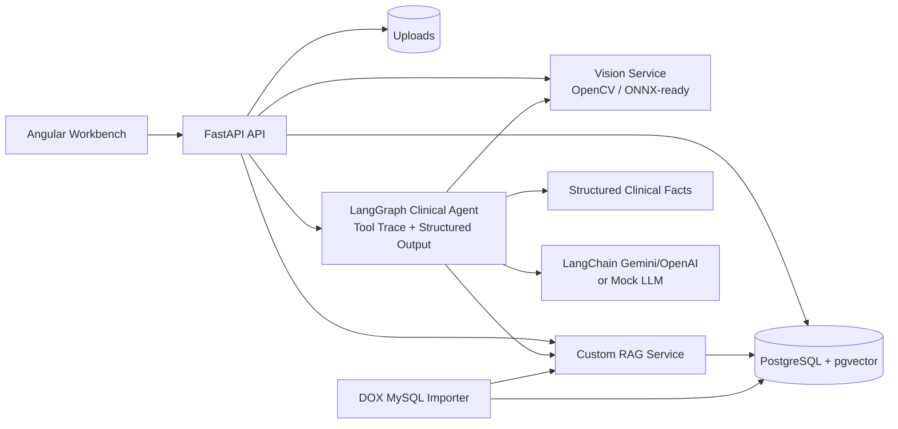

# Architecture

## Key Design

- The vision module returns structured findings rather than free text.
- The RAG module uses explicit chunking, deterministic demo embeddings, pgvector similarity search, and patient-scoped metadata filtering.
- The Agent module uses LangGraph for workflow orchestration and returns schema-shaped clinical drafts.
- LangChain is used at the model boundary through provider chat models and `with_structured_output(...)`; Gemini via Google AI Studio and OpenAI-compatible APIs are both supported while retrieval remains custom.
- The DOX MySQL importer separates source data into patient-scoped RAG chunks, global clinical knowledge chunks, and structured facts used by Agent tools.
- The frontend renders evidence and tool traces so the workflow is inspectable.

## Demo Safety Position

The model is intentionally treated as a replaceable component. The project demonstrates AI engineering workflow, not validated clinical diagnosis.
