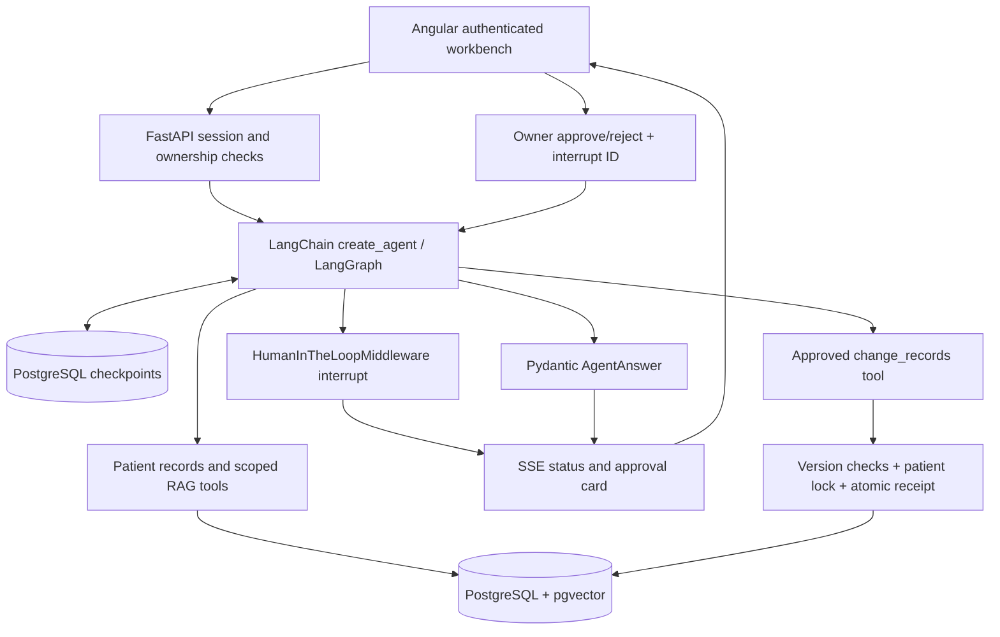

# Architecture: implemented workflow

## Accounts and authorization

`services/auth_service.py` authenticates an opaque HttpOnly cookie against a hashed server-side session token. Passwords use Argon2. Sessions expire after 12 hours; logout revokes one session and a password change revokes every session for that account. Browser writes validate Origin against `ALLOWED_ORIGINS`. Set `COOKIE_SECURE=true` behind HTTPS.

This is a **single shared clinic**, as requested: every registered member can access clinic patients and appointments. Personal conversations and approvals are restricted to their owner in SQL queries. Public registration currently grants clinic membership; invitation-only registration, role management and rate limiting remain deployment extensions. There is no email/phone verification.

Every business router is mounted with the authentication dependency in `main.py`, including RAG, imports and model checks. `/health`, OpenAPI documentation and auth entry points are public. The old `/api/chat` returns 410 after authentication; clients use `/api/conversations` instead.

## Memory and structured agent execution

`pms_agent_service.py` builds `create_agent` with `PostgresSaver`, `SummarizationMiddleware`, a per-run model-call limit, PII middleware and HITL middleware. `thread_id` is a server-created conversation UUID. Only the latest user message is submitted; message/tool history and interruptions are loaded from PostgreSQL. Summary generation reduces active context after 12,000 estimated tokens and keeps recent messages; historical checkpoints remain stored. This is persistent conversational short-term memory, not cross-conversation semantic long-term memory.

`schemas/operations.py` defines a discriminated Pydantic union for eight mutations: patient create/update/delete, appointment create/update/delete, note add/delete. `ToolStrategy(AgentAnswer)` validates the final answer, evidence IDs and limitations, with bounded graph execution. Provider models must support tool calling and structured-output tools. Mock mode emits a labeled structured response without external model calls or natural-language mutations.

Some providers ignore required tool choice and finish with plain text. `StructuredOutputMiddleware` detects this and permits at most two correction attempts. Before a write has been proposed in the current turn, correction retains business tools so the model can actually read records or propose a change through HITL. After a write proposal, execution or rejection, correction exposes only `AgentAnswer`, preventing business operations from being replayed while formatting an answer. These calls still pass through model-call limits and PII checks. Plain text is never silently accepted as a validated answer. Exhausted retries and provider error responses produce distinct safe error codes. Legacy conversations that ended without structured output can use Continue to finish only the answer, without replaying business tools.

The read tools return selected patient records, exact clinic statistics and scoped RAG evidence. The selected patient IDs are fixed at conversation creation. Start a new conversation to change scope or operate on a newly created patient. This scope is enforced in code, separately from clinic membership and prompts.

For a selected-patient conversation, `PatientContextMiddleware` invokes `read_records` once before the first model call of each new turn. The actual result is recorded as a tool message and exposed through the same SSE tool trace. A checkpoint flag prevents repeated automatic reads if summarization removes older messages. Reading uses internal patient UUIDs: a locally created patient does not need a DOX ID or clinical notes to have readable demographics. The model may request further reads when necessary. Creating a patient requires a name; the other editable demographics are optional.

## Approval, transactions and recovery

`HumanInTheLoopMiddleware` interrupts every `change_records` call before executing it. The checkpoint stores proposed arguments. The frontend shows those arguments and defaults each decision to rejection. Resume requests supply only the interrupt ID and ordered approve/reject decisions; they cannot edit arguments or choose another owner. `ApprovalAudit` stores decisions without copying note content.

The frontend opens a modal for an approval event or a restored pending review. Closing it postpones review without submitting a decision. Chat messages, execution traces, errors and expandable evidence/limitations share one scroll area; long supporting text does not shrink the conversation viewport or composer.

`conversation_service.py` holds a PostgreSQL advisory lock for the run, preventing simultaneous turns/resumes across workers. Existing records require the version returned by a read; changes while awaiting review cause a conflict and require a new proposal. Each mutation and its idempotent `MutationReceipt` commit in one transaction. Replaying the same framework tool-call ID returns its receipt, closing the business-commit/checkpoint-save crash window. Multiple approved tools are separate transactions, not an all-or-nothing batch; a later failure does not undo earlier successes. Identical intent proposed with a new tool-call ID is a new action and requires fresh approval.

Disconnecting the browser does not undo committed changes. Refresh the conversation to recover its checkpoint, pending review and transcript; use Continue for an interrupted execution that has no pending human review. SSE streams real execution stages and tool activity as they happen, followed by either approval or the validated answer. It does **not** stream raw JSON tokens or private reasoning. It currently has no event replay cursor or heartbeat transport.

`records_service.py` serializes appointment writes on the patient row and rejects overlapping scheduled/checked-in appointments for that patient. Timestamps require a timezone and positive duration. The workbench displays local time and supports scheduled, checked-in, completed and cancelled states. Clinician/resource calendars and recurring appointments are not implemented.

Note creation writes source text and vector chunks atomically. Re-indexing replaces note chunks. Deleting a note removes its vectors; deleting a patient removes associated notes, appointments, cases, structured facts and vectors in foreign-key order. Existing imports still use the importer path, so concurrent bulk imports and clinical edits should be operationally separated.

## Privacy, retrieval and limitations

Known selected-patient names, DOBs, addresses and identifiers are replaced by stable conversation tokens before entering the model; tokens are resolved for approval display and execution. UUIDs and concurrency versions are preserved as control fields. Short identifiers are masked in typed fields rather than replaced as arbitrary substrings. Built-in `PIIMiddleware` additionally redacts email and credit-card patterns at configured message/tool boundaries. These rules are not comprehensive de-identification: unknown names, unselected patients mentioned in text and new identity values may still reach a provider. Identity mappings and checkpoints remain sensitive local data; there is no at-rest encryption or retention cleanup yet.

Retrieval uses the existing deterministic educational embeddings, chunking and pgvector cosine similarity. It is not a semantic embedding model or reranker. Shared knowledge and patient notes are separate tables; patient queries use fixed patient filters. Evidence IDs are visible for inspection, but model citations are not independently verified and model output is not validated clinical advice.

Business tables use the existing idempotent startup initialization; checkpoint tables use the package's `setup()` migrations. A production rollout would additionally need managed schema migrations, operational monitoring, retention, backup policies and a fuller authorization model. Vision processing is not part of the current chat execution path.

## Verification

`tests/test_workspace_integration.py` uses a random PostgreSQL schema and a controllable tool-calling model. It tests real authentication, database mutations, HITL interruption/resume, durable checkpoint reload and tool replay without external LLM calls. Set `TEST_DATABASE_URL` to a development/test database with pgvector and CREATE SCHEMA permission. Without it these integration tests are explicitly skipped.

An additional provider smoke test is opt-in with `RUN_LIVE_AGENT_TESTS=1`. It calls the configured model with synthetic data to check creation proposals and selected local-patient reads; proposed creation is rejected. Browser regression checks run with `npm run build` followed by `npm run test:ui` in `frontend/`. Those browser checks intercept APIs and cover modals, SSE errors, and long answers with many limitations at desktop and mobile sizes; they do not replace the database or provider tests.

Framework references: [short-term memory](https://docs.langchain.com/oss/python/langchain/short-term-memory), [human-in-the-loop](https://docs.langchain.com/oss/python/langchain/human-in-the-loop), [structured output](https://docs.langchain.com/oss/python/langchain/structured-output). Installed package APIs are the source of truth when reference examples differ.
